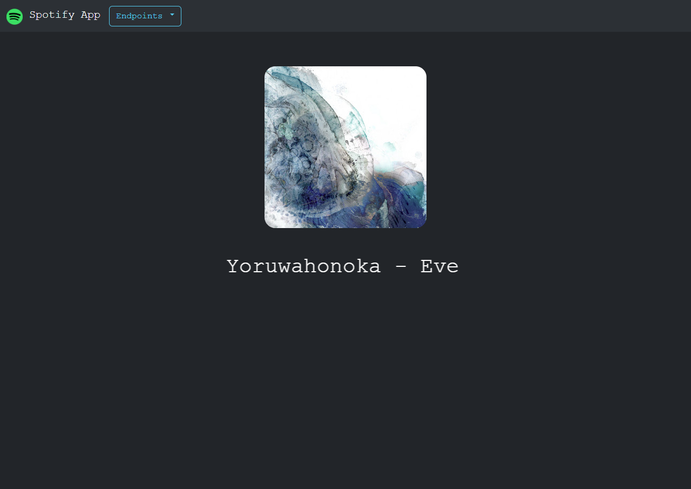

# flask-spotify-app

This flask project basically uses the Spotify API to grab data about your current song and user profile and displays it. Planning to add new features but this is more for my own learning.

Make sure you aren't using the proxy feature built into Spotify as from my own tests, the Spotify API doesn't play well with it.

